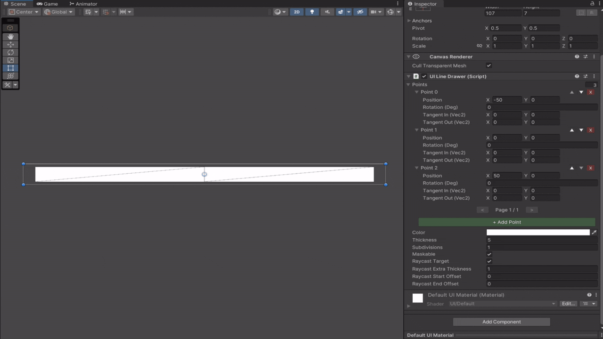
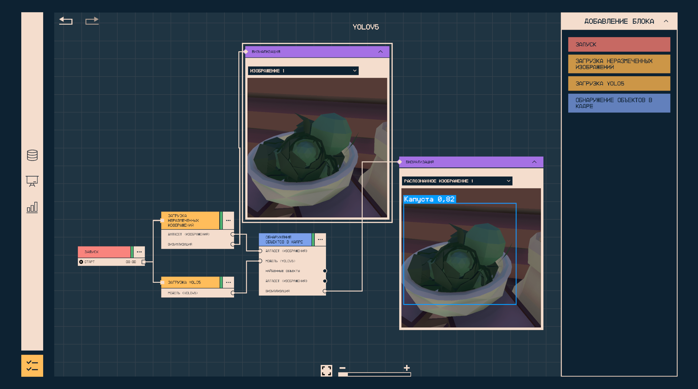

# UILineDrawer (WIP)

**UILineDrawer** is a Unity UI component for rendering smooth, high-quality lines directly inside the **Canvas** system.
It is designed for precise visual output and accurate interaction, using optimized mesh generation and spline-based curves.

The component is built on top of the custom Bezier spline implementation and supports adjustable thickness, configurable curve resolution, and robust raycasting directly along the rendered line.

UILineDrawer was developed and production-tested in the
[Д.И.В.О.](https://games.kruzhok.org/games_library/338) project (more in [Showcase](#showcase) section).

<details open>
    <summary>Line Example</summary>


> 4 point spline with subdivision level 3

</details>

<details>
    <summary>Mesh Generation</summary>


> Line mesh generation Example

</details>

---

## Motivation

Unity provides the built-in `LineRenderer` component, but integrating it into a **Canvas-based UI** requires non-trivial camera setup and workarounds.

When development of this component began (05.2025), existing solutions did not support **precise interaction with the line geometry**. Input events were handled for the entire bounding rectangle instead of the actual rendered line, making accurate UI interaction impossible.

UILineDrawer was created to solve this limitation.

---

## Features

* **Native Canvas Integration**: inherits from `MaskableGraphic`, ensuring full compatibility with Unity UI systems such as masking, layout, and batching.

* **Precise Raycasting**: supports raycast detection **along the line itself**, with configurable extra thickness and start/end padding.

* **Spline-Based Rendering**: uses custom spline implementation to render smooth Bezier curves with controllable tangents.

* **Mesh Optimization**: adjustable subdivision levels allow fine control over the balance between visual smoothness and vertex count.

* **Runtime API**: full C# API to add, remove, and modify spline points and visual properties at runtime.

---

## Dependencies

This package depends on the following Unity packages:

* **Mathematics** (`com.unity.mathematics`)

Make sure it installed via the Package Manager if they not installed automatically.

---

## Installation

```
https://github.com/Lamonin/UILineDrawer.git?path=/Assets/UILineDrawer/#0.2.1
```

1. Open **Window** → **Package Manager**.
2. Press the + button, choose "**Add package from git URL...**"
3. Enter url above and press **Add**.

---

## Usage

### Editor Setup

1. Create a **Canvas** in your scene.
2. Add an empty **GameObject** as a child of the Canvas.
3. Attach the `UILineDrawer` component.
4. Adjust **Thickness**, **Color**, and spline points in the Inspector.

---

### Runtime Example

```csharp
using UnityEngine;
using Unity.Mathematics;
using Maro.UILineDrawer;

public class LineController : MonoBehaviour
{
    [SerializeField]
    private UILineDrawer lineDrawer;

    void Start()
    {
        lineDrawer.AddPoint(new Vector2(-50, 0));
        
        lineDrawer.AddPoint(
            position: new Vector2(0, 50),
            tangentIn: new Vector2(-25, 0),
            tangentOut: new Vector2(25, 0),
            rotation: 0
        );
        
        lineDrawer.AddPoint(new Vector2(50, 0));

        lineDrawer.Thickness = 10f;
        lineDrawer.color = Color.red;
    }
}
```

---

## Configuration

| Property                       | Description                                                                          |
| ------------------------------ | ------------------------------------------------------------------------------------ |
| **Points**                     | Control points defining the spline curve.                                            |
| **Thickness**                  | Visual width of the line.                                                            |
| **Raycast Extra Thickness**    | Adds invisible padding to improve clickability of thin lines.                        |
| **Raycast Start / End Offset** | Excludes interaction near the start or end of the line (useful for fades).           |
| **Subdivisions**               | Curve resolution. Higher values produce smoother lines at the cost of more vertices. |

---

## Known Limitations

* **Work in Progress**: this package is actively developed. APIs and internal logic may change.

* **2D UI Space Only**: mesh generation is designed specifically for the Canvas (XY plane).

* **Performance Trade-off**: implementation prioritizes visual quality over maximum performance, using polygons efficiently to achieve clean and smooth line rendering. Perfect for mostly static lines.

---

## Showcase

### [Д.И.В.О.](https://games.kruzhok.org/games_library/338)

This package was originally developed and actively used to build a **visual node editor** for this project.



> UILineDrawer is used to render connection lines between nodes and to handle interaction (click detection) on those lines.

---

## License

UILineDrawer is distributed under the **MIT License**.
See the [LICENSE](LICENSE) file for full license text.

All contributions to this repository are assumed to be licensed under the MIT License.
